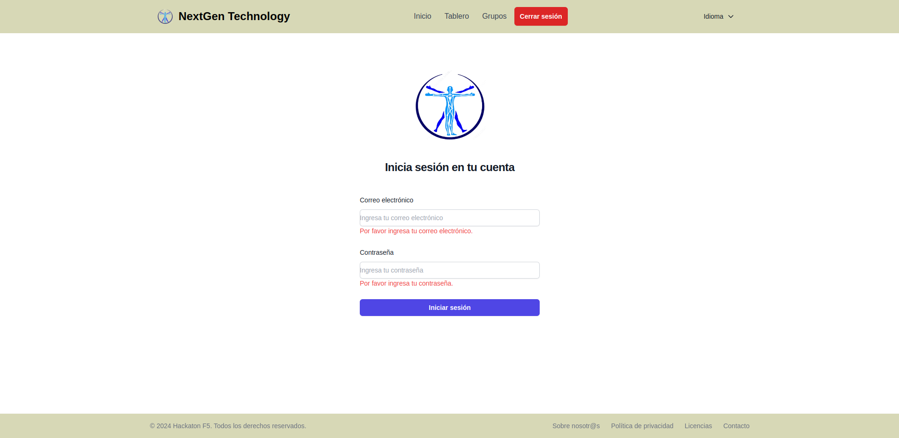
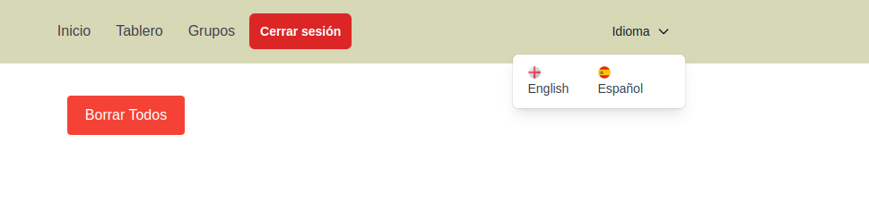
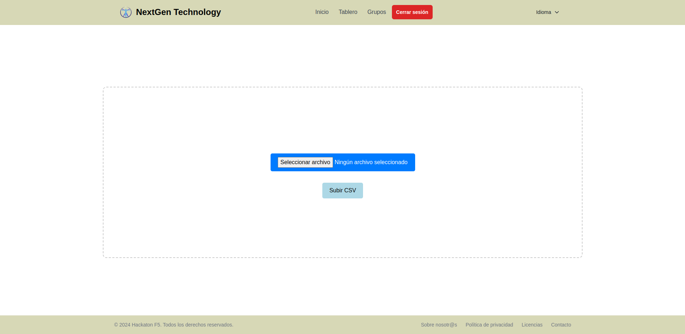
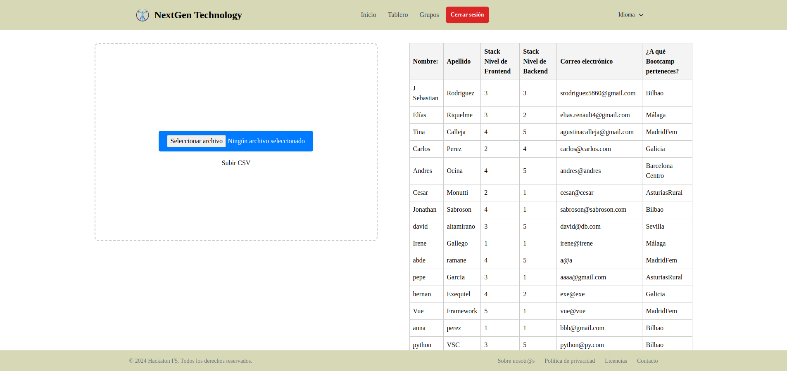
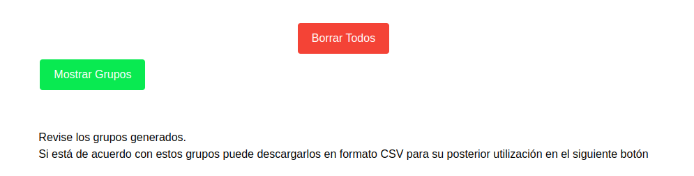
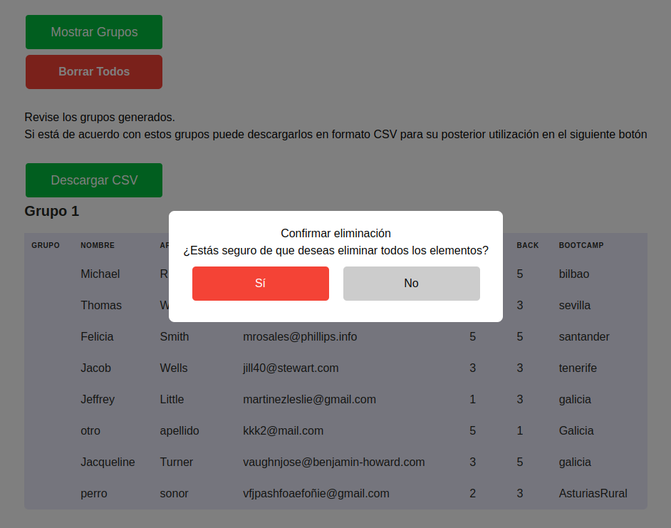
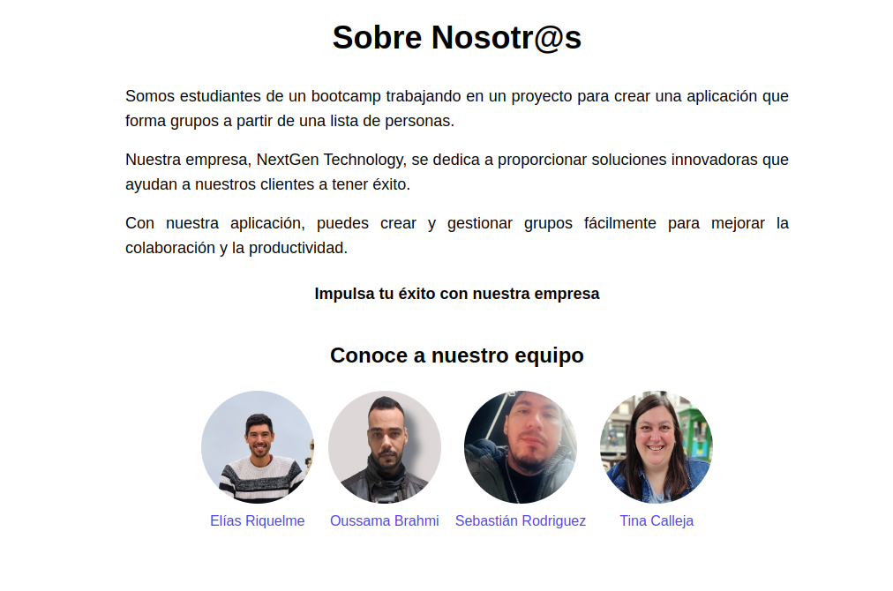
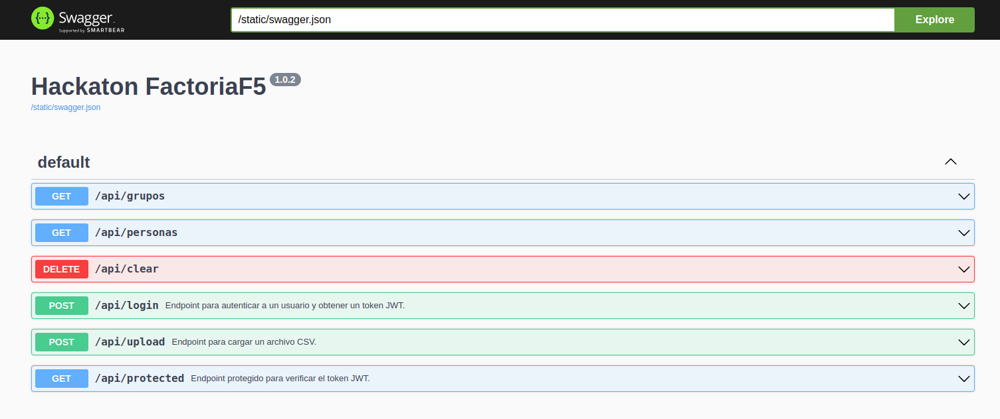
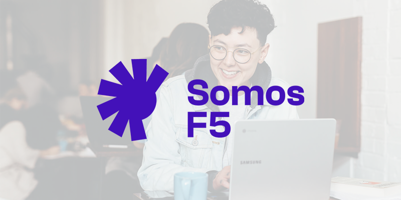

# Hackaton Organizer

<p align="center">
  
</p>

## Index


1. [Introduction](#introduction)
2. [Technologies](#technologies)
3. [Project Features](#project-features)
4. [Views](#views)
5. [Development team](#development-team)


## Introduction
<p align="justify">
Based on the requirement from the organization "Somos F5", Hackaton Organizer has been created, an internal management application whose fundamental axis is the structuring of an intelligent selector for the distribution of groups in the next national coder summit. The organizers of the massive developer meeting have pointed out representative flaws in their distribution structure of the different groups, and therefore have relied on programming logic to generate a system that takes defined parameters, such as: a limit of people per promotion , and balance the levels of Frontend along with Backend to make the competition as balanced a knowledge fight as possible. This in turn must meet the expectations that have been set in the approach market and show a product that is much more sensible and convincing than that of the immediately preceding years.

</p>

<p align="justify">
The purpose of Hackaton Organizer is to take a general database, provided by each of the area managers and subsequently regrouped, to house them in a system that is capable of processing it, and launch requests for its preparation. All this within reach of a click, which refines the work, and makes the exercise much more reliable for the benefit of all those involved.

</p>


### Direct access 

```
git clone: https://github.com/oussama2505/HackatonF5.git
```

## Technologies

                                                            

## Project Features:

<p align="justify">
1. Login:
</p>
<p align="justify">
- Gives the administrator access to the application interface.
</p>

<p align="justify">
2. Choice of languages:
</p>
<p align="justify">
- It allows the end consumer of the system to choose between two language options: English and Spanish.
</p>

<p align="justify">
3. Select a file:
</p>
<p align="justify">
- Through a file upload, the logged in administrator will be able to upload to the system in communication with the Backend a document that contains the requested fields, with the users or competitors of the event.

</p>

<p align="justify">
- What UploadCsv allows is to store the file in the database that from that moment on will be consulted by the system.
</p>
<p align="justify">
4. Show groups:
</p>
<p align="justify">
- Once the file is loaded, pressing this button displays a protocol that runs through the elements and dynamically paints them in cards.
</p>

<p align="justify">
- In addition, a view of the file in the original format has been added to serve as support for the administrator, so that he can appropriate the data that he wants to upload to the system..
</p>
<p align="justify">
5. Delete all data:
</p>
<p align="justify">
- This button serves the purpose of eliminating the upload of files. Eliminates the database that runs in the remote Backend, making it necessary to comply with the loading protocol from scratch to carry out a new deployment.
</p>

<p align="justify">
6. Logout:
</p>
<p align="justify">
- Terminates the process that has started since the login. This allows the administrator to control the time spent staying within the application.
</p>

<p align="justify">
- This section has included a modal window that shows the administrator a warning, detailing precisely that accepting the process will eliminate the file that has previously been uploaded to the Dashboard from the database.

</p>

<p align="justify">
7. About us:
</p>
<p align="justify">
- This section generates an additional view that directly shows contact links for the entire development team.
</p>



## Views:

### Home:
<p align="justify">
This view has 3 components: the header, the login and the footer. Its main objective is to internally display a login form that has two fields, the email field and the password field. Once identified, the administrator will have access to the application to upload the file that will contain the necessary fields, with the verified users who have already notified their presence at the event.
</p>

### Dashboard:
<p align="justify">
This view displays an interface for loading the file that contains the data that the system will process. The uploader will be able to see a selection button that will inspect the files that are stored on a hard drive (internal or external) that meets the requested characteristics. This view contains three components: the header, the UploadCsv and the footer.
</p>

### Groups:
<p align="justify">
The central axis of the application, this view contains not only the header and the footer, but also adds the logic of the communication between the Frontend and the Backend. The TeamDetail component brings the requested fields from the database and inserts them into letters that are dynamically fed. Additionally, it incorporates two more components, which distribute the groups, and cleans the loaded database in case you want to add a new load of a file containing corporate data.
</p>

## External

### Swagger:


## Development team:


Below you will find the detailed list of each of the members in the construction of the project, with a link to their contact.

- [Elías Riquelme (scrum master)](https://www.linkedin.com/in/elias-javier-riquelme-b62655297/)
- [Johan Sebastián Rodríguez (product owner)](https://www.linkedin.com/in/johan-sebastian-rodriguez-g/)
- [Agustina Calleja (web developer)](https://www.linkedin.com/in/tina-calleja/)
- [Oussama Brahmi (web developer)](https://www.linkedin.com/in/oussama-brahmi-b1551a280/)

## Special mention:




<p align="justify">
As a work team, we want to extend our most sincere thanks to the project managers. The trust, constant support and feedback given at specific moments made the process a very important moment within the training moment.
</p>
<p align="justify">
On the part of the stakeholder (Andrés Patiño), and the organization specifically, Somos F5, the effort to provide sufficient tools and maintain motivation at the highest level has fueled the competitive spirit of the group that has managed to deliver a minimum product with care. feasible in the agreed time.
</p>
